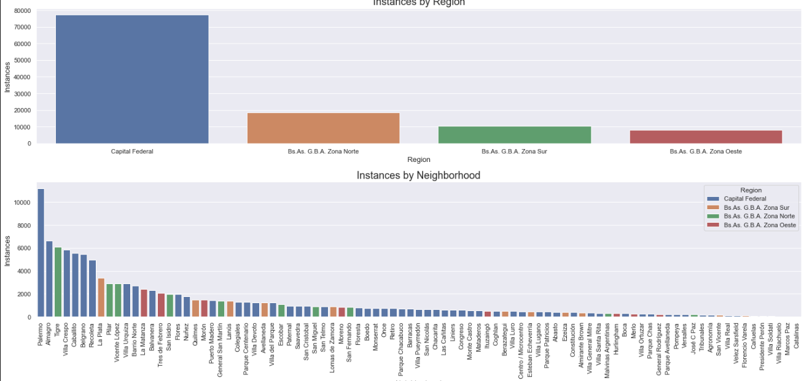

## Buenos Aires House Pricing Prediction 

### Project Overview
* Analyzed a real estate agency dataset and build different regression models for predicting estate prices in the Autonomous City of Buenos Aires area, obtaining an RMSE=27076 and R²=0.91 in the best model.
* PCA and Geographic information analysis was done.
* Optimized Linear Regression, K-Neighbors, Decision Tree and Gradient Boosting Regressors to reach the best model.
* Analyzed models errors, feature importances and residuals.
* The Project is divided in 3 Parts/Notebooks:
    * Part 1: EDA
    * Part 2: Machine Learning - First Models: Linear Regression, Knn, Decision Tree.
    * Part 3: Machine Learning - Ensemble Models: Random Forest, Gradient Boosting.

### Code and Resources Used 
**Python Version:** 3.7  
**Packages:** numpy, pandas, sklearn, matplotlib, seaborn.

### Dataset
* The original dataset is taken from Properati (www.properati.com.ar) and contains information of 146.660 houses in Buenos Aires State, represented by 19 features describing the parameters of the properties. A subset with only the Autonomous City of Buenos Aires area properties was built.
* Dataset: www.properati.com.ar/data

### EDA
* Data distributions analysis and value counts for categorical variables
* Target analysis by region and by property type grouping.
* Outliers analysis and IQR filtering.
* Correlation analysis, PCA, geographic data analysis and maps visualizations.
* Categorical data encoding.
* (captures)

### Models Building and Performance
Data was splited into train (75%) and test (25%) sets.  
A first model (benchmark 1) was developed and tested against 2 models, and the best of them (benchmark 2) was tested against 2 more complex models.  
We chose a Linear Regression Model as baseline 1 because it's a simple, interpretable and at the same time powerful model.   
Given that the Decision Tree Model had the best performance of the first group (becoming benchmark 2), we chose to go deeper with this type of algorithm testing 2 ensembles of it: Bagging y Boosting, what we did this using a Random Forest Regressor and a Gradient Boosting Regressor respectively.

* **Linear Regression (baseline 1)**: RMSE=51883, R²=0.69.
* **KNN**: RMSE=34054, R² =0.86.
* **Decision Tree Regressor (baseline 2)**: RMSE=36568, R²=0.84.
* **Random Forest Regressor**: RMSE=27195, R²=0.91. 
* **Gradient Boosting Regressor**: RMSE=27076, R²=0.91.

The Gradient Boosting Regressor model outperformed the other approaches on train and test sets. 

### Metrics Chosen

**R²** for Model performance, and **𝑅𝑀𝑆𝐸** for residuals measurement.
   
* **R² (Coefficient of determination)**: measures how well models approximated actual data, letting us know which will be the models performance against unseen data.  
    Reasons for the choise:  
    - It's scale free, what let us know if our model is good regardless of the model output values: it's value is always between -∞ and 1.  
    (This is the default metric of Sklearn regression models, so it is the `score()` method output).
    
* **RMSE (Root Mean Squared Error)**: measures the Standard Deviation of residual values (differences between predicted and real values).  
    Reasons for the choise:    
    - Uses the same scale as the target variable "Price" (that's why we chose it instead of MSE).
    - It's easily differentiable, what makes it easy to use in conjunction with derivative-based methods like gradient descent (that's why we chose it instead of MAE).
---